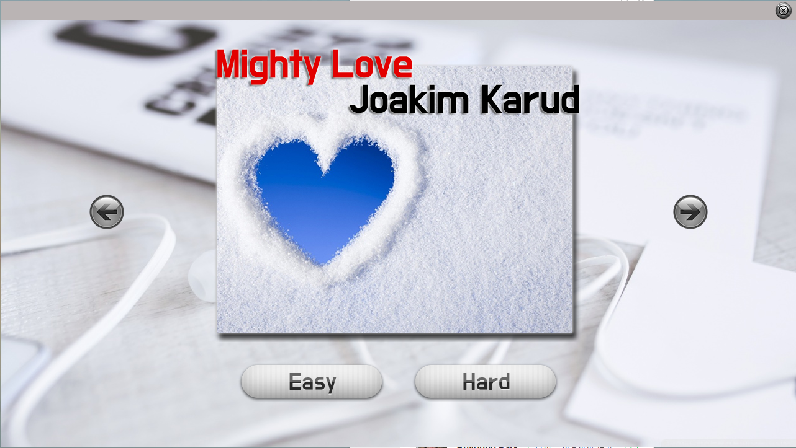
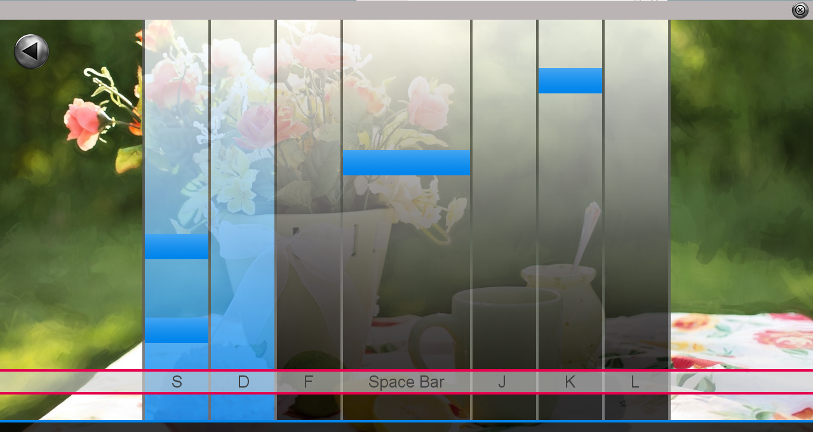

# Java-Dynamic-Beat-Game

This is a rythm game based on Java. Users can select embedded songs and play with it. 

### Screenshots

## Authors
Injun Son

## Acknowledgments
This is the program that I tried to practice Java and the code is based on below video.
https://www.youtube.com/watch?v=xs92kqU2YWg&list=PLRx0vPvlEmdDySO3wDqMYGKMVH4Qa4QhR
